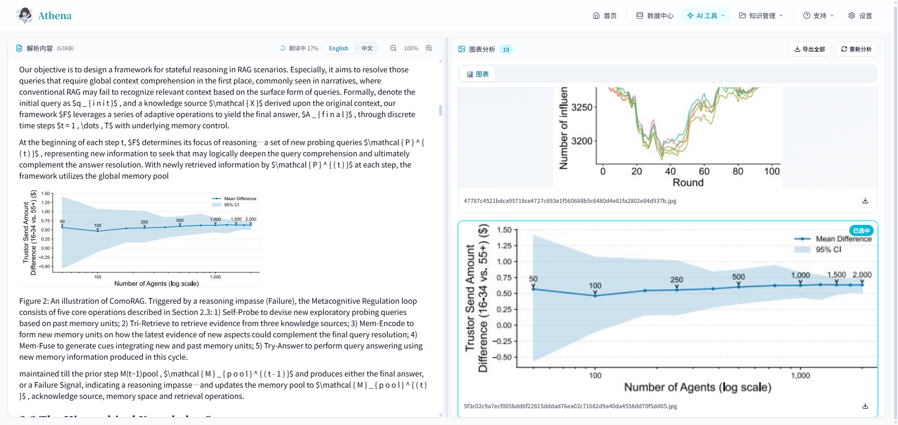
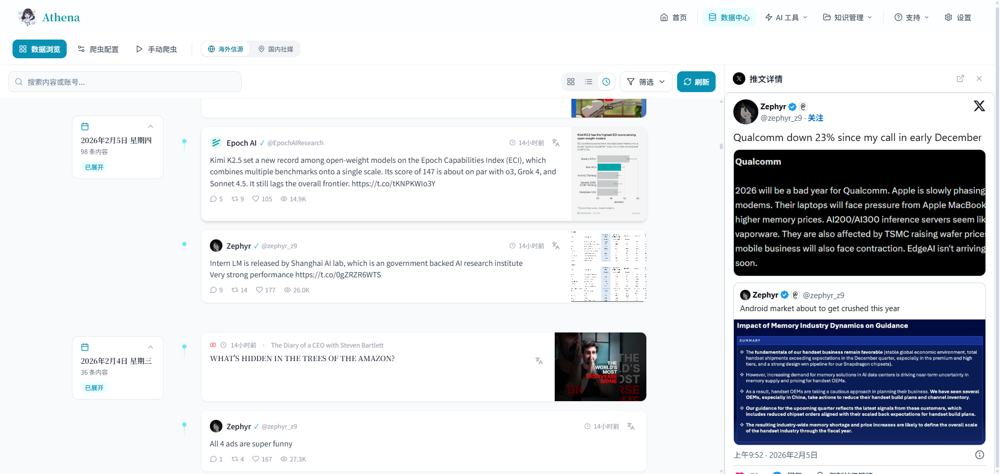

# Athena - AI 战略分析师效率引擎

<p align="center">
  
</p>

<p align="center">
  
  
  
  
  
  
</p>

<p align="center">
  <b>为 AI 战略分析师打造的一站式智能工作台</b><br>
  提升日常工作效率，洞察全球 AI 行业前沿
</p>

<p align="center">
  <a href="#-快速开始">快速开始</a> •
  <a href="#-核心功能">核心功能</a> •
  <a href="#-api-文档">API 文档</a> •
  <a href="#-部署指南">部署指南</a> •
  <a href="#-贡献指南">贡献指南</a>
</p>

---

## 📸 功能预览

<details open>
<summary><b>点击展开/收起截图</b></summary>

<table>
  <tr>
    <td align="center" width="50%">
      <b>🏠 首页</b><br>
      
      <sub>核心功能概览，快速入口</sub>
    </td>
    <td align="center" width="50%">
      <b>🧠 术语通</b><br>
      
      <sub>AI 实时流式对话，专业术语秒懂</sub>
    </td>
  </tr>
  <tr>
    <td align="center" width="50%">
      <b>📄 论文伴侣</b><br>
      
      <sub>PDF 智能分析 · 结构化解读 · 一键收藏</sub>
    </td>
    <td align="center" width="50%">
      <b>🔬 PDF 智析</b><br>
      
      <sub>MinerU 云端解析 · 图表提取 · 自动翻译</sub>
    </td>
  </tr>
  <tr>
    <td align="center" width="50%">
      <b>📚 知识卡片</b><br>
      
      <sub>术语收藏 · 论文分析存档 · 3D 卡片复习</sub>
    </td>
    <td align="center" width="50%">
      <b>📊 数据中心</b><br>
      
      <sub>海内外信源抓取 · 支持手动新增信源 · 自动爬取</sub>
    </td>
  </tr>
</table>

</details>

---

## 📖 项目背景

Athena 是一款为 AI 战略分析师打造的一站式智能工作台，融合了 **AI 辅助认知提升**、**全球信源聚合** 和 **智能文档处理** 三大核心能力。

### 核心痛点

| 痛点 | 描述 |
|------|------|
| 🔤 **术语理解困难** | 专业名词缺乏即时可靠的解释来源 |
| 📚 **论文阅读压力** | 需要快速理解论文核心观点并准备讲解材料 |
| 📄 **PDF 处理繁琐** | 英文 PDF 阅读困难，图表提取耗时 |
| 📁 **知识分散难查** | 团队文档分散，缺乏统一管理和语义检索 |
| 🧠 **概念易遗忘** | 学过的内容缺少系统化的记录和复习机制 |
| 🌍 **信源分散难追** | 全球 AI 领域 KOL 动态分散在各平台，难以统一追踪 |

---

## ✨ 核心功能

### 1. 术语通 (Jargon Killer) 🧠

> 遇到不懂的专业名词？AI 导师秒级响应，用通俗易懂的语言解释复杂概念

**核心特性：**
- ⚡ **流式实时响应**：基于 SSE 技术，即时看到 AI 逐字生成的回复
- 🔄 **多轮深度追问**：支持持续追问，直到彻底理解概念
- 🎯 **双模式切换**：思考模式（Qwen2.5-72B）与快速模式（Qwen2.5-7B）
- 💾 **一键收藏**：将重要概念直接保存到知识卡片

### 2. 论文伴侣 (Paper Copilot) 📄

> 上传 PDF 或输入 Arxiv 链接，自动提取核心观点、生成结构化分析报告

**核心特性：**
- 📄 **多种输入方式**：支持 PDF 上传和 Arxiv 链接导入
- 📊 **结构化报告**：自动生成核心问题、前人困境、核心直觉、关键步骤等
- 🎤 **讲解文稿**：生成口语化演讲稿，使用生活化类比解释复杂概念
- 💬 **论文对话**：基于论文内容的智能问答，深入理解论文细节
- ⭐ **一键收藏**：将论文分析结果保存到知识卡片，随时回顾

### 3. PDF 智析 (PDF Analyzer) 🔬

> 基于 MinerU 云端 API 的智能 PDF 解析服务，支持文件上传和 URL 解析

**核心特性：**
- 🌐 **双模式解析**：支持本地文件上传或远程 URL 直接解析
- 📊 **图表智能提取**：自动识别并提取 PDF 中的图表、流程图、表格
- 🔄 **实时进度反馈**：SSE 流式返回解析进度，用户体验流畅
- 🌍 **自动翻译**：解析完成后自动将英文内容翻译为中文
- 📝 **Markdown 输出**：提取的文本以 Markdown 格式呈现，保留原文结构
- 🖼️ **图片渲染**：解析出的图片实时渲染在右侧面板

**技术亮点：**
- 集成 [MinerU](https://mineru.net/) 云端 API，支持复杂 PDF 解析
- 异步任务管理，支持任务取消和状态查询
- 智能图片缓存，避免跨会话图片混淆

### 4. 知识沉淀 (Team Brain) 💾

> 上传团队文档，构建可检索的智能知识库，基于语义搜索快速定位内容

**核心特性：**
- 📚 **文档管理**：统一上传和保存 PDF 格式的内部文档
- 🔍 **向量检索**：基于 BGE-M3 Embedding 模型的语义搜索
- 🤖 **智能问答**：基于 RAG 架构的上下文增强对话
- 📝 **报告生成**：自动生成包含核心摘要、关键概念的结构化报告

### 5. 知识卡片 (Knowledge Cards) 📚

> 统一管理术语收藏和论文分析，构建个人知识体系

**核心特性：**
- 📖 **双类型支持**：同时管理「术语收藏」和「论文分析」两种知识卡片
- 💡 **智能收藏**：从术语通和论文伴侣中一键保存内容
- 🎴 **3D 卡片效果**：精美的卡片翻转动画，提升学习体验
- 📊 **分类筛选**：按类型（全部/术语/论文）快速筛选查看
- 🔍 **快速搜索**：支持关键词搜索已学概念
- 💾 **本地存储**：数据持久化保存在浏览器本地

### 6. 数据中心 (Data Hub) 📊

> 全球 AI 信源聚合，一站式追踪行业前沿动态

**核心特性：**
- 🌍 **海外信源聚合**：整合 YouTube、X等平台的 40+ AI 领域 KOL 内容
- 🎛️ **爬虫配置管理**：可视化界面管理信源列表和爬取策略
  - **信源管理**：查看所有已配置信源，显示账号头像、粉丝数、认证状态
  - **批量添加**：支持一次添加多个账号 URL，自动识别平台
  - **灵活删除**：一键删除指定信源，带二次确认保护
  - **智能搜索**：快速过滤和定位目标信源
- ⚙️ **自动爬取配置**：动态调整爬虫策略无需重启服务
  - **开关控制**：一键启用/禁用自动爬取
  - **间隔调整**：支持 1-24 小时多档位爬取频率
  - **实时生效**：配置立即应用到后台任务
- 🔍 **多维度筛选**：平台筛选、账号多选筛选、时间范围筛选、时间线视图
- 📺 **iframe 嵌入渲染**：直接在页面内观看 YouTube 视频和阅读 X 推文
- 🕷️ **手动爬取**：支持一键触发爬取，立即获取最新内容

---

## 📡 API 文档

Athena 提供完整的 RESTful API，支持开发者集成和二次开发。

### 在线文档

| 文档类型 | 地址 | 说明 |
|---------|------|------|
| **API 文档中心** | `/api-docs` | 交互式 API 文档，支持在线测试 |
| **Swagger UI** | `/docs` | FastAPI 自动生成的 OpenAPI 文档 |
| **ReDoc** | `/redoc` | 美观的 API 文档界面 |

### API 分类概览

| 分类 | 端点前缀 | 主要功能 |
|------|----------|----------|
| 🔬 PDF 智析 | `/api/pdf-analyzer` | PDF 解析、图表提取、任务管理 |
| 🕷️ 数据爬虫 | `/api/crawler` | 信源管理、数据爬取、配置管理、数据查询 |
| 🌍 翻译服务 | `/api/translate` | 多语言文本翻译 |
| 💬 AI 对话 | `/api/chat` | 普通对话、流式对话 |
| 🧠 知识库 | `/api/knowledge` | 文档上传、检索、分析 |
| 📄 论文分析 | `/api/paper` | 论文解析、讲稿生成、问答 |

### 示例：PDF 解析 API

```bash
# 流式解析 PDF（通过 URL）
curl -X POST "https://your-backend.com/api/pdf-analyzer/analyze/stream" \
  -H "X-API-Key: your-siliconflow-key" \
  -H "X-MinerU-API-Key: your-mineru-key" \
  -F "url=https://arxiv.org/pdf/2301.00001.pdf" \
  -F "translate=false" \
  -F "extract_charts=true"
```

### 示例：爬虫配置 API

```bash
# 获取当前爬虫配置
curl -X GET "http://localhost:8000/api/crawler/config"

# 更新爬虫配置（启用自动爬取，设置 2 小时间隔）
curl -X POST "http://localhost:8000/api/crawler/config" \
  -H "Content-Type: application/json" \
  -d '{
    "auto_crawl_enabled": true,
    "interval_seconds": 7200
  }'

# 添加信源
curl -X POST "http://localhost:8000/api/crawler/sources" \
  -H "Content-Type: application/json" \
  -d '{"url": "https://twitter.com/karpathy"}'

# 删除信源
curl -X DELETE "http://localhost:8000/api/crawler/sources" \
  -H "Content-Type: application/json" \
  -d '{"platform": "twitter", "name": "karpathy"}'

# 手动触发全量爬取
curl -X POST "http://localhost:8000/api/crawler/crawl/all"
```

---

## 🚀 快速开始

### 环境要求

| 依赖 | 版本要求 |
|------|----------|
| Node.js | >= 18.0.0 |
| Python | >= 3.9 |
| npm / pnpm | 最新版本 |

### 一键启动（推荐）

#### macOS / Linux / Git Bash / WSL

```bash
# 克隆项目
git clone https://github.com/Ryder-MHumble/Athena.git
cd Athena

# 赋予执行权限
chmod +x start.sh stop.sh

# 启动所有服务
./start.sh

# 停止所有服务
./stop.sh
```

#### Windows PowerShell

```powershell
# 克隆项目
git clone https://github.com/Ryder-MHumble/Athena.git
cd Athena

# 如果遇到执行策略限制，先运行：
Set-ExecutionPolicy -ExecutionPolicy RemoteSigned -Scope CurrentUser

# 启动所有服务
.\start.ps1

# 停止所有服务
.\stop.ps1
```

**一键启动脚本会自动：**
- ✅ 检测并提示安装 Python 和 Node.js（如需要）
- ✅ 安装项目依赖
- ✅ 启动后端服务（端口 8000）
- ✅ 启动前端服务（端口 3000）
- ✅ 自动打开浏览器

### 手动启动

**后端：**
```bash
cd backend
pip install -r requirements.txt
python run.py
```

**前端（新终端）：**
```bash
cd frontend
npm install --legacy-peer-deps
npm run dev
```

---

## ⚙️ 环境配置

### 必需配置

1. **SiliconFlow API Key**（必需）
   - 访问 [SiliconFlow](https://siliconflow.cn/) 注册获取（首次注册赠送 2000 万 Tokens）
   - 在应用的 **设置页面** (`/settings`) 输入 API Key

2. **MinerU API Key**（PDF 智析功能必需）
   - 访问 [MinerU](https://mineru.net/) 注册获取
   - 在应用的 **设置页面** (`/settings`) 输入 API Key

### 可选配置

```bash
# 后端环境变量 (.env)
TWITTER_API_KEY=your_twitter_api_key      # Twitter API 密钥（爬虫功能）

# 爬虫配置（推荐通过 UI 界面管理，以下为默认值）
ENABLE_AUTO_CRAWL=false                    # 启用自动爬虫（默认关闭）
CRAWLER_INTERVAL_SECONDS=10800             # 爬取间隔（默认 3 小时）

# 前端环境变量 (.env.local) - 仅前后端分离部署时需要
NEXT_PUBLIC_API_URL=https://your-backend.onrender.com
```

**注意**：爬虫配置现已支持通过 **数据中心 > 爬虫配置** 页面可视化管理，配置实时生效无需重启服务。环境变量仅作为首次启动的默认值使用。

### 支持的 AI 模型

| 厂商 | 模型系列 | 特点 |
|------|----------|------|
| 通义千问 | Qwen2.5 系列、Qwen3-VL | 综合性能强，支持多模态 |
| 智谱 GLM | GLM-4.7、GLM-4.6 | 中文理解出色 |
| Kimi | Kimi-K2-Thinking | 256K 超长上下文 |
| DeepSeek | DeepSeek-V3、DeepSeek-R1 | 推理能力强 |

---

## 🌐 部署指南

### 本地开发

| 服务 | 地址 |
|------|------|
| 前端应用 | http://localhost:3000 |
| 后端 API | http://localhost:8000 |
| API 文档 | http://localhost:3000/api-docs |
| Swagger | http://localhost:8000/docs |

### 云端部署

Athena 支持前后端分离部署，推荐方案：

| 服务 | 推荐平台 | 说明 |
|------|----------|------|
| 前端 | Vercel | 零配置部署 Next.js |
| 后端 | Render / Railway | 支持 Python 应用 |

**后端部署示例（Render）：**
1. 连接 GitHub 仓库
2. 选择 `backend` 目录
3. 设置启动命令：`uvicorn app.main:app --host 0.0.0.0 --port $PORT`
4. 配置环境变量

**前端部署示例（Vercel）：**
1. 导入 GitHub 仓库
2. 选择 `frontend` 目录
3. 设置 `NEXT_PUBLIC_API_URL` 指向后端地址

---

## 📂 项目结构

```
Athena/
├── frontend/                    # Next.js 前端应用
│   ├── app/                    # 应用路由和页面
│   │   ├── jargon-killer/      # 术语通模块
│   │   ├── paper-copilot/      # 论文伴侣模块
│   │   ├── pdf-analyzer/       # PDF 智析模块 ✨
│   │   ├── team-brain/         # 知识沉淀模块
│   │   ├── data-hub/           # 数据中心模块 ✨
│   │   │   ├── components/
│   │   │   │   ├── CrawlerConfigSection.tsx    # 爬虫配置主页面 ✨
│   │   │   │   ├── CrawlerSettingsPanel.tsx    # 配置面板 ✨
│   │   │   │   ├── SourceCard.tsx              # 信源卡片 ✨
│   │   │   │   └── AddSourceModal.tsx          # 添加信源弹窗 ✨
│   │   │   └── page.tsx        # 数据中心主页（三级标签页）✨
│   │   ├── flashcards/         # 知识卡片模块
│   │   ├── api-docs/           # API 文档中心 ✨
│   │   └── settings/           # 设置页面
│   ├── components/             # 可复用组件
│   │   └── ui/                 # UI 基础组件
│   │       ├── switch.tsx      # 开关组件 ✨
│   │       └── select.tsx      # 选择器组件 ✨
│   ├── hooks/                  # 自定义 Hooks ✨
│   │   └── usePDFAnalysis.ts   # PDF 分析状态管理
│   ├── lib/                    # 工具函数
│   └── stores/                 # Zustand 状态管理
│
├── backend/                     # FastAPI 后端应用
│   ├── app/
│   │   ├── api/                # API 路由
│   │   │   ├── pdf_analyzer.py # PDF 智析 API ✨
│   │   │   ├── crawler.py      # 爬虫 API（配置管理）✨
│   │   │   ├── docs.py         # API 文档 ✨
│   │   │   └── ...
│   │   ├── services/           # 业务逻辑
│   │   │   ├── pdf_analyzer_service.py  # MinerU 集成 ✨
│   │   │   ├── task_manager.py          # 任务管理 ✨
│   │   │   ├── config_service.py        # 爬虫配置管理 ✨
│   │   │   └── crawler_service.py
│   │   ├── utils/              # 工具模块 ✨
│   │   │   └── resilience.py   # 重试/熔断/限流
│   │   ├── prompts/            # AI 提示词模板
│   │   ├── Info_sources/       # 信源配置
│   │   │   ├── sources.json    # 信源列表
│   │   │   └── crawler_config.json  # 爬虫配置 ✨
│   │   └── main.py             # 应用入口（动态任务调度）✨
│   └── requirements.txt
│
├── start.sh / start.ps1        # 一键启动脚本
├── stop.sh / stop.ps1          # 停止脚本
└── README.md
```

---

## 🛠️ 技术架构

### 前端技术栈

- **框架**：Next.js 14 (App Router)
- **语言**：TypeScript 5.4
- **样式**：Tailwind CSS 3.4
- **状态管理**：Zustand
- **UI 组件**：Radix UI + Lucide Icons
- **HTTP 客户端**：Fetch API + SSE

### 后端技术栈

- **框架**：FastAPI
- **语言**：Python 3.9+
- **AI 集成**：LangChain + SiliconFlow API
- **PDF 解析**：MinerU Cloud API
- **向量数据库**：Supabase pgvector
- **异步处理**：asyncio + httpx

### 系统特性

| 特性 | 实现方式 |
|------|----------|
| 流式响应 | Server-Sent Events (SSE) |
| 任务管理 | asyncio + 状态机 |
| 错误恢复 | 重试机制 + 熔断器 |
| 健康监控 | 健康检查 + 状态追踪 |

---

## 🐛 常见问题

<details>
<summary><b>Q: 端口被占用怎么办？</b></summary>

```bash
# Windows
netstat -ano | findstr "8000"
taskkill /PID <PID> /F

# Linux/Mac
lsof -i :8000
kill -9 <PID>
```
</details>

<details>
<summary><b>Q: PDF 解析失败？</b></summary>

1. 检查 MinerU API Key 是否正确配置
2. 确认 PDF 文件大小不超过 50MB
3. 如果是 URL 解析，确保 URL 可公开访问
4. 查看后端日志获取详细错误信息
</details>

<details>
<summary><b>Q: 翻译功能不工作？</b></summary>

1. 确认 SiliconFlow API Key 已配置
2. 检查 API Key 余额是否充足
3. 翻译功能需要解析完成后自动触发
</details>

<details>
<summary><b>Q: 依赖安装失败？</b></summary>

```bash
# Python 依赖
pip install -r requirements.txt --no-cache-dir

# Node.js 依赖
npm install --legacy-peer-deps
```
</details>

<details>
<summary><b>Q: 如何管理爬虫信源和配置？</b></summary>

1. 进入 **数据中心 > 爬虫配置** 页面
2. 点击"添加信源"，支持批量输入 Twitter/YouTube URL
3. 在右侧配置面板调整自动爬取开关和间隔
4. 配置保存后立即生效，无需重启后端服务
5. 信源卡片显示头像、粉丝数、认证状态等信息
6. 支持一键删除信源（带二次确认）
</details>

---

## 💡 使用建议

| 场景 | 推荐功能 | 模型选择 |
|------|----------|----------|
| 日常术语查询 | 术语通 | Qwen2.5-7B（性价比高）|
| 阅读英文论文 | PDF 智析 | - |
| 深度论文分析 | 论文伴侣 | GLM-4.7（复杂推理）|
| 长文档处理 | 知识沉淀 | Kimi-K2（256K 上下文）|
| 追踪行业动态 | 数据中心 | - |

---

## 🤝 贡献指南

欢迎提交 Issue 和 Pull Request！

1. Fork 本仓库
2. 创建特性分支 (`git checkout -b feature/AmazingFeature`)
3. 提交更改 (`git commit -m 'Add some AmazingFeature'`)
4. 推送到分支 (`git push origin feature/AmazingFeature`)
5. 开启 Pull Request

---

## 📄 开源协议

本项目采用 MIT 协议开源。详见 [LICENSE](LICENSE) 文件。

---

## 🙏 致谢

- [SiliconFlow](https://siliconflow.cn/) - 高性能 LLM API 服务
- [MinerU](https://mineru.net/) - 智能 PDF 解析服务
- [Next.js](https://nextjs.org/) - 优秀的 React 框架
- [FastAPI](https://fastapi.tiangolo.com/) - 现代化的 Python Web 框架
- [LangChain](https://langchain.com/) - AI 应用开发框架
- [Supabase](https://supabase.com/) - 开源 Firebase 替代方案

---

<p align="center">
  <b>由 Ryder Sun 打造</b><br>
  让学习更智能，让知识更有价值 ✨
</p>

<p align="center">
  如果这个项目对你有帮助，请给一个 ⭐️ Star 支持一下！
</p>
