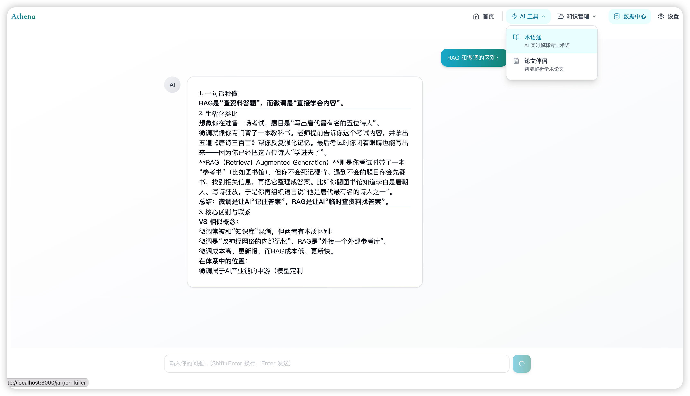
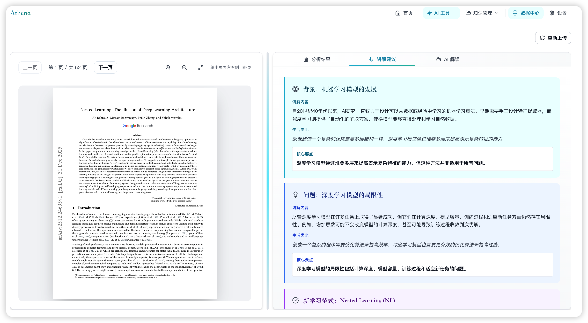
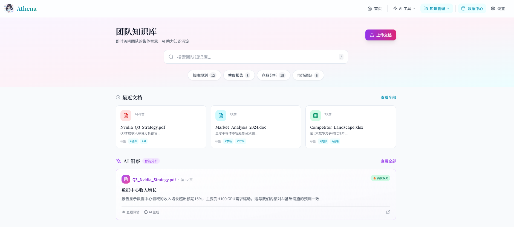
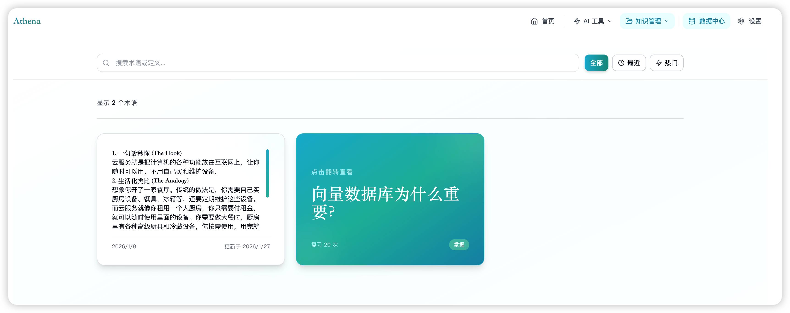

# Athena - AI 战略分析师智能工作台

<p align="center">
  
</p>

<p align="center">
  
  
  
  
  
</p>

<p align="center">
  <b>专为非技术背景用户设计的 AI 智能工作台</b><br>
  让学习和研究变得简单有趣
</p>

---

## 📸 功能预览

> 以下截图展示了 Athena 的核心功能界面

| 功能模块 | 界面预览 | 描述 |
|:-------:|:-------:|:-----|
| **首页** |  | 现代化的落地页设计，展示核心功能入口 |
| **术语通** |  | AI 对话界面，实时流式响应专业术语解释 |
| **论文伴侣** |  | PDF 上传与结构化论文分析报告 |
| **知识沉淀** |  | 团队知识库文档管理与智能检索「还存在bug」 |
| **数据中心** | 暂时未接入爬虫能力 | 多平台数据采集与可视化展示 |
| **单词本** |  | 3D 翻转卡片式概念复习 |

## 📖 项目背景

Athena 是一款面向知识工作者的 AI 智能工作台，特别针对需要快速学习、理解复杂概念的用户设计。项目解决以下核心痛点：

- **🔤 术语理解困难**：遇到专业名词时缺乏即时可靠的解释来源
- **📚 论文分享压力**：需要快速理解论文核心观点并准备讲解材料
- **📁 知识分散难查**：团队文档分散，缺乏统一管理和语义检索能力
- **🧠 概念易遗忘**：学过的内容缺少系统化的记录和复习机制
- **📊 数据洞察需求**：需要从多平台采集和分析内容数据

## ✨ 核心功能

### 1. 术语通 (Jargon Killer)

> 遇到不懂的专业名词？AI 导师秒级响应，用通俗易懂的语言解释复杂概念

**核心特性：**
- ⚡ **流式实时响应**：基于 SSE 技术，即时看到 AI 逐字生成的回复
- 🔄 **多轮深度追问**：支持持续追问，直到彻底理解概念
- 🎯 **双模式切换**：思考模式（精确）与快速模式（高效）自由切换
- 💾 **一键收藏**：将重要概念直接保存到单词本

### 2. 论文伴侣 (Paper Copilot)

> 上传 PDF 或输入 Arxiv 链接，自动提取核心观点、生成结构化分析报告

**核心特性：**
- 📄 **多种输入方式**：支持 PDF 上传和 Arxiv 链接导入
- 📊 **结构化报告**：自动生成核心问题、前人困境、核心直觉、关键步骤等
- 🎤 **讲解文稿**：生成口语化演讲稿，使用生活化类比解释复杂概念
- ❓ **预判提问**：智能预测可能的提问并准备答案

### 3. 知识沉淀 (Team Brain)

> 上传团队文档，构建可检索的智能知识库，基于语义搜索快速定位内容

**核心特性：**
- 📚 **文档管理**：统一上传和保存 PDF 格式的内部文档
- 🔍 **向量检索**：基于 BGE-M3 Embedding 模型的语义搜索
- 🤖 **智能问答**：基于 RAG 架构的上下文增强对话
- 📝 **报告生成**：自动生成包含核心摘要、关键概念的结构化报告

### 4. 数据中心 (Data Hub)

> 多平台社媒数据采集与分析，洞察内容趋势

**核心特性：**
- 🌐 **多平台支持**：小红书、抖音、快手、B站、微博、贴吧、知乎
- 📈 **数据可视化**：采集量、情感指数、互动量等数据统计
- 🔧 **爬虫配置**：基于 [MediaCrawler](https://github.com/NanmiCoder/MediaCrawler) 的可视化配置界面
- 🎯 **情感分析**：AI 自动分析内容情感倾向

### 5. 灵感单词本 (Flashcards)

> 像记单词一样记录和复习 AI 解释过的概念

**核心特性：**
- 💡 **智能收藏**：从术语通对话中一键保存概念和解释
- 🎴 **3D 卡片效果**：精美的卡片翻转动画
- 🔍 **快速搜索**：支持关键词搜索已学概念
- 💾 **本地存储**：数据持久化保存在浏览器本地

## 🏗️ 技术架构

### 前端技术栈

| 技术 | 版本 | 说明 |
|-----|-----|-----|
| Next.js | 14 | 现代化全栈 React 框架 |
| TypeScript | 5.4 | 类型安全的开发体验 |
| Tailwind CSS | 3.4 | 实用优先的 CSS 框架 |
| shadcn/ui | - | 可访问性优先的组件库 |
| Zustand | 4.5 | 轻量级状态管理 |
| react-markdown | - | Markdown 渲染 |
| react-pdf | - | PDF 文档预览 |

### 后端技术栈

| 技术 | 说明 |
|-----|-----|
| FastAPI | 高性能异步 Python Web 框架 |
| LangChain | AI 应用开发框架 |
| SiliconFlow API | LLM 服务提供商 |
| Supabase + pgvector | 向量数据库 |
| BGE-M3 | 多语言向量模型 |
| PyMuPDF | PDF 文本提取 |

### 架构图

```
┌─────────────────────────────────────────────────┐
│           Frontend (Next.js 14)                 │
│  ┌──────────┐ ┌──────────┐ ┌──────────┐        │
│  │ 术语通   │ │ 论文伴侣 │ │ 知识沉淀 │        │
│  └──────────┘ └──────────┘ └──────────┘        │
│  ┌──────────┐ ┌──────────┐                      │
│  │ 数据中心 │ │ 单词本   │                      │
│  └──────────┘ └──────────┘                      │
│                    │                            │
│              HTTP/SSE API                       │
└────────────────────┼────────────────────────────┘
                     │
┌────────────────────┼────────────────────────────┐
│           Backend (FastAPI)                     │
│  ┌──────────────────────────────────────────┐  │
│  │            Service Layer                  │  │
│  │  ┌────────┐ ┌────────┐ ┌────────┐        │  │
│  │  │  LLM   │ │  RAG   │ │ Search │        │  │
│  │  │Service │ │Service │ │Service │        │  │
│  │  └────────┘ └────────┘ └────────┘        │  │
│  └──────────────────────────────────────────┘  │
└────────────────────┼────────────────────────────┘
                     │
    ┌────────────────┼────────────────┐
    │                │                │
┌───┴────┐    ┌─────┴─────┐    ┌─────┴─────┐
│Silicon │    │ Supabase  │    │ DuckDuck  │
│Flow API│    │ pgvector  │    │ Go Search │
└────────┘    └───────────┘    └───────────┘
```

## 🚀 快速开始

### 环境要求

- **Node.js**: >= 18.0.0
- **Python**: >= 3.9
- **npm** 或 **pnpm**

### 一键启动（推荐）

```bash
# 克隆项目
git clone https://github.com/Ryder-MHumble/Athena.git
cd Athena

# 启动所有服务
./start.sh

# 停止所有服务
./stop.sh
```

脚本会自动：
- ✅ 检查并安装依赖
- ✅ 启动后端服务（端口 8000）
- ✅ 启动前端服务（端口 3000）
- ✅ 自动打开浏览器

### 手动启动

**后端：**
```bash
cd backend
pip install -r requirements.txt
python run.py
```

**前端（新终端）：**
```bash
cd frontend
npm install
npm run dev
```

### 环境配置

1. 访问 [SiliconFlow](https://siliconflow.cn/) 注册并获取 API Key
2. 在应用的**设置页面**输入 API Key
3. 配置团队访问密钥（用于知识库功能）

## 📂 项目结构

```
Athena/
├── frontend/                 # Next.js 前端应用
│   ├── app/                 # 应用路由和页面
│   │   ├── jargon-killer/   # 术语通模块
│   │   ├── paper-copilot/   # 论文伴侣模块
│   │   ├── team-brain/      # 知识沉淀模块
│   │   ├── data-hub/        # 数据中心模块
│   │   ├── flashcards/      # 单词本模块
│   │   └── settings/        # 设置页面
│   ├── components/          # 可复用组件
│   ├── lib/                 # 工具函数和 API 客户端
│   └── stores/              # Zustand 状态管理
│
├── backend/                  # FastAPI 后端应用
│   ├── app/
│   │   ├── api/             # API 路由
│   │   ├── services/        # 业务逻辑层
│   │   ├── models/          # 数据模型
│   │   ├── prompts/         # AI 提示词模板
│   │   └── config.py        # 配置管理
│   └── requirements.txt     # Python 依赖
│
├── start.sh                 # 一键启动脚本
├── stop.sh                  # 停止脚本
└── README.md
```

## 🌟 核心特色

### 为非技术背景用户设计

- 直观的界面设计，无需技术背景
- 通俗易懂的语言解释
- 生活化的类比，降低理解门槛

### 流式 AI 响应

采用 Server-Sent Events (SSE) 技术实现实时流式输出，无需等待即可看到 AI 逐字生成的回复。

### 智能模型选择

- **高质量推理**：Qwen2.5-72B-Instruct
- **快速响应**：Qwen2.5-7B-Instruct

### 向量检索增强 (RAG)

知识库采用 RAG 架构，使用 BGE-M3 多语言向量模型 + Supabase pgvector 实现高性能语义检索。

## 📊 访问地址

| 服务 | 地址 |
|-----|-----|
| 前端应用 | http://localhost:3000 |
| 后端 API | http://localhost:8000 |
| API 文档 | http://localhost:8000/docs |

## 🐛 常见问题

### 端口被占用

停止占用端口的进程，或修改配置文件中的端口号。

### API Key 错误

确保在设置页面正确配置了 SiliconFlow API Key。

### 文档上传失败

1. 检查文件格式是否为 PDF
2. 确认团队访问密钥配置正确
3. 查看后端日志获取详细错误信息

---

<p align="center">
  <b>由 Ryder Sun 打造</b><br>
  让学习更智能 ✨
</p>
